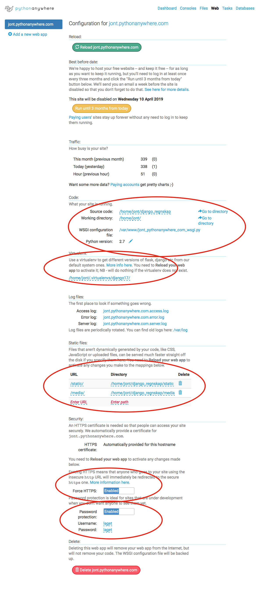

How to run on pythonanywhere.com
===============================

For this version to work you need to create a virtual envirement so you can install packages and install a old version of Django.

### 1. Create virtual envirement

To create the virtual envirement named `django17` do

```
mkvirtualenv django17 --python=/usr/bin/python2.7
workon django17
```

then you can install packages, including an old version of Django:
```
pip install -r requirements.txt
```

### 2. configure WSGI and the site

You need to set up:

 - The path to the code and working directory
 - The path to the WSGI-python file
 - The path to media and static

It is also adviced to:

 - Turn on HTTPS
 - Configure to use username and password

 The WSGI-python file should look like this: [jont_pythonanywhere_com_wsgi.py
](jont_pythonanywhere_com_wsgi.py)

 See settings below:

 
